# Write-Path Analysis — SalesPro CRM ("Venom CRM")

**Phase:** Audit — Write Path Analysis
**Status:** Read-only research. No code, schema, or configuration was modified to produce this document.
**Source of truth:** current repository state on branch `claude/crm-system-audit-22311i`, verified by direct file inspection (not by prior internal docs, which were found to be partially stale in Phase 1).

---

## 1. Scope & Methodology

This document traces **every operation in the codebase that writes to the database**, end-to-end, from the UI trigger down to the SQL statement executed against PostgreSQL (Supabase). For each operation it records: entry point, component, store action, API client function, route + operation name, SQL/table/columns, validation, authorization, cache invalidation, realtime propagation, optimistic-update behavior, rollback behavior, and transaction behavior — exactly as requested.

Evidence was gathered by:
- Direct reading of all 18 API route files, `lib/session.ts`, `lib/auth-guard.ts`, `lib/supabase-admin.ts`, `lib/api-cache.ts`, `lib/store.ts`, `lib/supabase.ts`, `lib/crm-utils.ts`.
- Direct reading of `page.tsx` (realtime wiring) and targeted reads of every component handler identified below.
- Exhaustive `grep` sweeps across `src/` to find every call site of every write-capable client function (`apiCreateLead`, `apiUpdateLead`, `apiDeleteLead`, `apiArchiveLeads`, `apiAddTeamMember`, `apiSaveAccessPermissions`, `fetch('/api/auth', ...)`, etc.), so that "used vs. orphaned" claims below are based on **zero-vs-nonzero call-site counts**, not assumption.

### 1.1 Architectural note: the requested layer model does not fully exist

The requested trace shape is:

```
UI Component → Hook → Store → API Client → API Route → Business Logic → Supabase → SQL → Database
```

In this codebase **there is no distinct "Hook" layer for writes.** There are only three custom hooks in `src/hooks/` (`use-ai.ts`, `use-mobile.ts`, `use-toast.ts`), none of which wrap a write operation. Every write is triggered by an inline `useCallback` handler defined directly inside the page-level component (e.g. `tele-sheet.tsx`'s `handleUpdateField`), which calls the Zustand store's optimistic-update action and the `lib/supabase.ts` API client function directly, in the same function body. So the real shape is:

```
UI Component (useCallback handler) → Zustand Store action (optimistic) → API Client (lib/supabase.ts) → API Route → Business Logic → Supabase client → SQL → PostgreSQL
                                    ↘ (on success/failure) → Store action (confirm/rollback)
```

This is itself a finding: **all business-logic cascades (status→meetingDate, closed-won dual-write, etc.) live in UI component handlers, not in a shared hook or service layer** — which is the direct cause of the duplication documented in §6.2.

---

## 2. High-Level Write Architecture

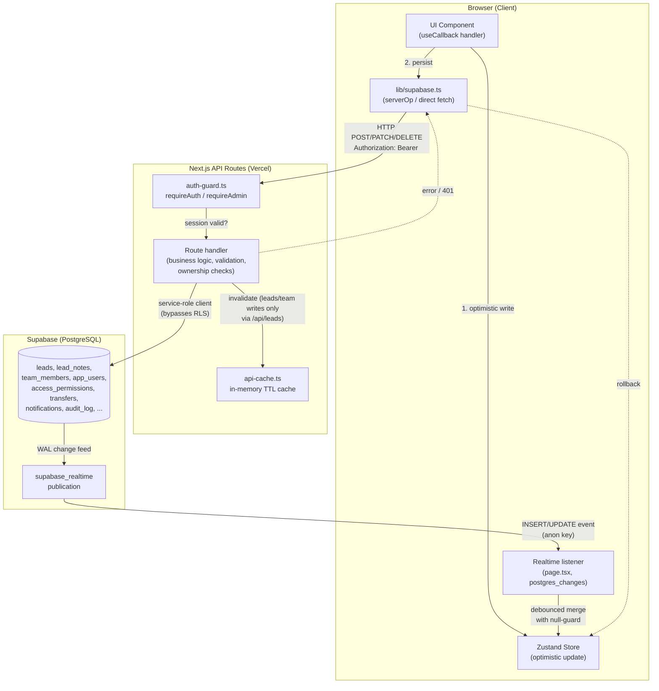

Two independent channels update the client's `leads` cache after any write: (a) the direct HTTP response from the API route, and (b) the Supabase realtime `postgres_changes` event fired by the same write. Both paths write into the same Zustand store (`updateLeadInCache`/`addLeadToCache`), which is the origin of the race conditions discussed in §6.6.

---

## 3. Master Inventory of Write Operations

| # | Operation | Trigger Component(s) | Store Action | API Client Fn | Route / Operation | Table(s) | Cache Invalidated? | Rollback? |
|---|---|---|---|---|---|---|---|---|
| 1 | Create lead (single) | `tele-sheet.tsx`, `sales-sheet.tsx` | `addLeadToCache` | `apiCreateLead` | `POST /api/leads` `create` | `leads` | ✅ | N/A (no optimistic pre-write) |
| 2 | Create leads (bulk) | `bulk-add.tsx`, `tele-sheet.tsx` (Quick Paste), `sales-sheet.tsx` (Quick Paste) | `batchAddLeadsToCache` | `apiBulkCreateLeads` | `POST /api/leads` `bulkCreate` | `leads` | ✅ | N/A |
| 3 | Update lead field (generic, incl. status cascade) | `tele-sheet.tsx`, `sales-sheet.tsx` `handleUpdateField` | `updateLeadInCache` → `revertLeadInCache` | `apiUpdateLead` | `POST /api/leads` `update` | `leads` (+ `notifications` if `attended` present) | ✅ | ✅ |
| 4 | Update notes field (`salesStatus` overload) | `follow-up-section.tsx` `NotesCell`, `sales-sheet.tsx` `NotesCell` | `updateLeadInCache` → `revertLeadInCache` | `apiUpdateLead` | `POST /api/leads` `update` | `leads.sales_status` | ✅ | ✅ |
| 5 | Mark attendance | `my-meetings.tsx` `handleMarkAttendance`, `employee-profile.tsx` `handleMarkAttendance` (duplicate impl.) | `updateLeadInCache` → `revertLeadInCache` | `apiUpdateLead` | `POST /api/leads` `update` | `leads` + `notifications` (server-side insert) | ✅ | ✅ (my-meetings only, see §6.8) |
| 5b | Mark attendance (**dead path**) | none (orphaned) | — | `apiMarkMeetingAttendance` (0 callers) | `PATCH /api/meetings` | `leads` | ❌ (route never imports api-cache) | — |
| 6 | Transfer lead to sales | `tele-sheet.tsx` `handleTransferToSales` | `updateLeadInCache` (no rollback wired) | `apiUpdateLead` + `apiCreateTransfer` | `POST /api/leads` `update` + `POST /api/transfers` | `leads` + `transfers` + `notifications` | ✅ (leads only) | ❌ |
| 7 | Cancel transfer | `tele-sheet.tsx` `handleCancelTransfer` | `updateLeadInCache` (no rollback wired) | `apiUpdateLead` | `POST /api/leads` `update` | `leads` | ✅ | ❌ |
| 8 | Delete lead (single) | `tele-sheet.tsx`, `sales-sheet.tsx` | `removeLeadFromCache` | `apiDeleteLead` | `DELETE /api/leads` | `leads` (hard delete, cascades `lead_notes`) | ✅ | ❌ |
| 9 | Delete leads (bulk) | `tele-sheet.tsx`, `sales-sheet.tsx`, `admin-panel.tsx` `AllLeadsTab` | `batchRemoveLeadsFromCache` | `apiDeleteLeadsBulk` | `POST /api/leads` `bulkDelete` | `leads` | ✅ | ❌ |
| 10 | Archive leads (bulk) | `tele-sheet.tsx`, `sales-sheet.tsx`, `admin-panel.tsx` | `archiveLeadsInCache` | `apiArchiveLeads` | `POST /api/leads` `archive` | `leads` | ✅ | ❌ |
| 11 | Unarchive leads | `my-archive.tsx`, `admin-panel.tsx` `ArchiveTab` | `unarchiveLeadsInCache` | `apiUnarchiveLeads` | `POST /api/leads` `unarchive` | `leads` | ✅ | ❌ |
| 12 | Bulk update (generic) | *(no confirmed UI caller found)* | — | *(none — `serverOp('bulkUpdate', …)` has no client wrapper)* | `POST /api/leads` `bulkUpdate` | `leads` | ❌ (see §6.7 — `bulkUpdate` missing from `WRITE_OPERATIONS`) | — |
| 13 | Add team member | `admin-panel.tsx` `TeamTab.handleAdd`, `UsersTab.handleCreateUser` | local `setTeam` (manual merge, not a store action) | `apiAddTeamMember` | `POST /api/leads` `addTeamMember` | `team_members` (+ `leads` if reactivating) | ✅ | ❌ (client-side team list not rolled back on failure) |
| 14 | Remove team member (live path) | `admin-panel.tsx` `TeamTab.handleRemove` | local `setTeam` | `apiRemoveTeamMember` | `POST /api/leads` `removeTeamMember` | `team_members` + `leads` (archive, non-archived only) | ✅ | ❌ |
| 14b | Remove team member (**dead, divergent path**) | none (orphaned) | — | *(no client wrapper calls `/api/team` POST)* | `POST /api/team` `remove` | `team_members` + `leads` (**nulls** `tele_name`/`sales_name` on **all** rows, including archived) | ❌ (route never imports api-cache) | — |
| 15 | Rename team member | `admin-panel.tsx` `TeamTab.handleRename`, `UsersTab.handleLinkName` | local `setTeam` | `apiRenameTeamMember` | `POST /api/leads` `renameTeamMember` | `team_members` + `leads` (all rows, no archived filter) | ✅ | ❌ |
| 15b | Rename team member (**dead, divergent path**) | none (orphaned) | — | — | `POST /api/team` `rename` | `team_members` + `leads` | ❌ | — |
| 16 | Save access permissions | `admin-panel.tsx` `SettingsTab.handleSave` | local (`teleAccess`/`salesAccess` already in store, pre-save) | `apiSaveAccessPermissions` | `POST /api/leads` `saveAccessPermissions` | `access_permissions` (full delete + reinsert) | ✅ | N/A |
| 17 | Save global setting | *(no confirmed UI caller found)* | — | *(no client wrapper)* | `POST /api/leads` `saveSetting` | `settings` | ❌ (typo: set has `'setSetting'`, case is `'saveSetting'`) | — |
| 18 | User: create | `admin-panel.tsx` `UsersTab.handleCreateUser` | none (raw `fetch`) | raw `fetch('/api/auth')` | `POST /api/auth` `create-user` | `app_users` (+ `team_members` cascade) | N/A (not lead data) | N/A |
| 19 | User: toggle active | `admin-panel.tsx` `UsersTab.handleToggleUser` | none | raw `fetch('/api/auth')` | `POST /api/auth` `toggle-user` | `app_users` | N/A | N/A |
| 20 | User: reset password | `admin-panel.tsx` `UsersTab.handleResetPassword` | none | raw `fetch('/api/auth')` | `POST /api/auth` `reset-password` | `app_users` | N/A | N/A |
| 21 | User: delete | `admin-panel.tsx` `UsersTab.handleDeleteUser` | none | raw `fetch('/api/auth')` | `POST /api/auth` `delete-user` | `app_users` | N/A | N/A |
| 22 | User: change own password | *(no UI entry point found — see §5.8.1)* | — | *(none)* | `POST /api/auth` `change-password` | `app_users` | N/A | N/A |
| 23 | Login | `login-screen.tsx` | `login` (sets auth + token) | raw `fetch('/api/auth')` | `POST /api/auth` `login` | `app_users` (updates `last_login_at`, possibly `password_hash` on legacy-hash upgrade) | N/A | N/A |
| 24 | Mark notification read | `topbar.tsx` | `markNotificationRead` (local, optimistic) | `apiMarkNotificationRead` | `PATCH /api/notifications` | `notifications` | N/A (not lead cache) | ❌ (no revert on failure) |
| 25 | Mark all notifications read | `topbar.tsx` | `markAllNotificationsRead` | `apiMarkAllNotificationsRead` | `PATCH /api/notifications` (`all:true`) | `notifications` | N/A | ❌ |
| 26 | Add lead note (**dead path**) | none (orphaned) | — | `apiAddNote` (0 callers) | `POST /api/leads` `addNote` | `lead_notes` | ✅ | — |
| 27 | Delete/update lead note (**dead path**) | none (orphaned) | — | `apiDeleteNote` (0 callers) | `POST /api/leads` `deleteNote`/`updateNote` | `lead_notes` | ✅ / ❌ (`updateNote` bypasses `success()` wrapper entirely) | — |
| 28 | WhatsApp-style chat message (**dead path**) | none (orphaned — no component fetches `/api/chat`) | — | — | `POST /api/chat` | `lead_notes` | N/A | — |
| 29 | Submit daily report (**dead path**) | none (orphaned — `daily-report.tsx` is read-only analytics, unrelated to this API) | — | `apiSubmitDailyReport` (0 callers) | `POST /api/daily-reports` | `daily_reports` | N/A | — |
| 30 | Create transfer record | `tele-sheet.tsx` (secondary call inside `handleTransferToSales`) | none | `apiCreateTransfer` | `POST /api/transfers` | `transfers` + `notifications` | N/A | N/A (explicitly non-fatal if it fails) |
| 31 | Google Sheets webhook ingest | External (Google Apps Script / Sheets webhook) | — | — | `POST /api/sheets-sync` | `leads` (bulk insert) | ❌ (route never imports api-cache) | — |
| 32 | Admin: cleanup orphaned leads | `admin-panel.tsx` (button, if wired) / manual `curl` | — | raw `fetch` | `POST /api/cleanup-orphaned-leads` | `leads` (bulk archive) | ❌ | — |
| 33 | Admin: fix sales/tele mismatch | manual / admin tool | — | raw `fetch` | `POST /api/fix-sales-leads-tele` | `leads` (bulk null `tele_name`) | ❌ | — |
| 34 | Admin: fix null `created_at` | manual / admin tool | — | raw `fetch` | `POST /api/diagnose-leads-dates` | `leads` (bulk `created_at = now()`) | ❌ | — |
| 35 | Password auto-upgrade (legacy→bcrypt) | *(side effect of #23 Login)* | — | — | inside `POST /api/auth` `login` | `app_users.password_hash`, `password_salt` | N/A | N/A |
| 36 | Attendance notification (server-side) | *(side effect of #3/#5 when `attended` present)* | — | — | inside `POST /api/leads` `update` | `notifications` | N/A | N/A |
| 37 | Transfer notification (server-side) | *(side effect of #6/#30)* | — | — | inside `POST /api/transfers` | `notifications` | N/A | N/A |

**37 distinct write pathways were identified.** Of these, **8 are confirmed dead code** (zero client call sites: #5b, #12, #14b/15b, #17, #26, #27, #28, #29) yet remain live, reachable, authenticated HTTP endpoints in production.

---

## 4. Detailed Write-Path Traces

### 4.1 Create Lead (single)

**Entry point:** "➕ إضافة" row in `tele-sheet.tsx` / `sales-sheet.tsx`.

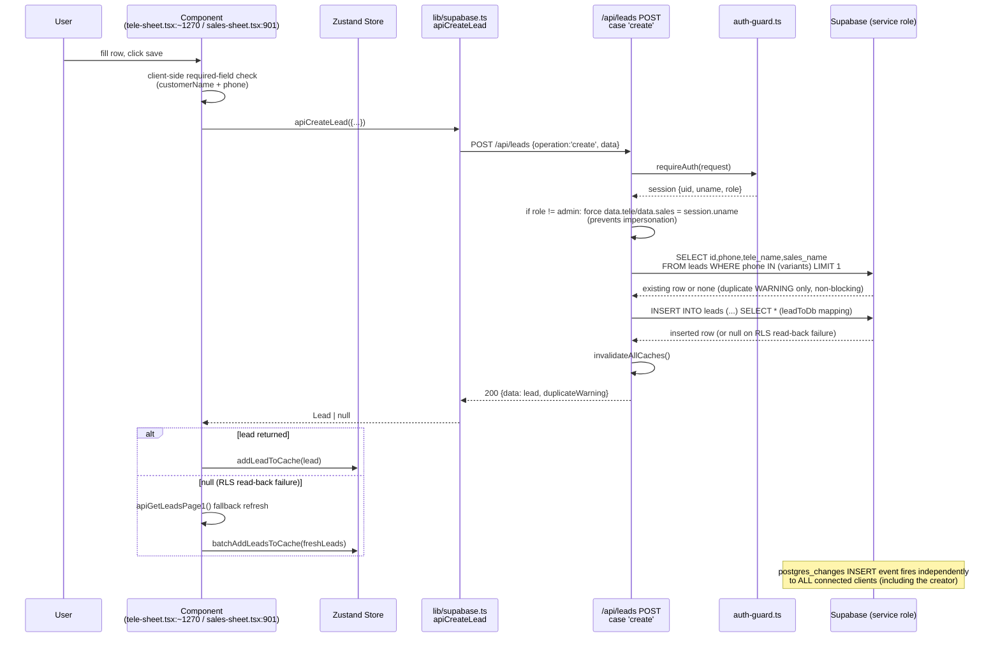

- **Validation:** client-side only checks `customerName`/`phone` non-empty (varies slightly: sales-sheet requires both; tele-sheet's add-row path is similar). Server does **no field validation** on `create` beyond the phone-duplicate warning (which is advisory, not blocking — duplicates are explicitly allowed).
- **Authorization:** `requireAuth` (any authenticated role). Ownership is enforced by **overwriting** `tele`/`sales` to the session user server-side — the client-submitted value for these two fields is discarded for non-admins.
- **Transaction:** single `INSERT`, no explicit transaction block; the pre-check `SELECT` and the `INSERT` are two separate round-trips with no isolation — a duplicate created concurrently between the check and the insert is not caught (acceptable here since duplicates are allowed, but worth noting there is no `UNIQUE` constraint on `phone` at the DB level either).
- **Notable defect:** if `.select().single()` returns `null` after a successful insert (documented as an RLS read-back quirk), the code falls back to `ORDER BY created_at DESC LIMIT 1` to find "the row we just inserted" (`route.ts:456-469`). Under concurrent creates from two different users, **this fallback can return the wrong row** — there is no way to disambiguate "my insert" from a different user's insert that landed at the same instant.

### 4.2 Create Leads (bulk)

**Entry point:** `bulk-add.tsx` submit, and "Quick Paste" dialogs inside `tele-sheet.tsx`/`sales-sheet.tsx`.

```mermaid
sequenceDiagram
    participant U as User
    participant C as bulk-add.tsx<br/>handleSubmit (:708)
    participant S as Zustand Store
    participant A as apiBulkCreateLeads
    participant R as /api/leads POST<br/>case 'bulkCreate'
    participant DB as Supabase

    U->>C: paste/import rows, click submit
    C->>C: validateRow() per row (client-side)
    C->>A: apiBulkCreateLeads(leads[])
    A->>R: POST {operation:'bulkCreate', data: leads[]}
    R->>R: reject if leads.length > 500
    R->>R: force tele/sales to session.uname for non-admins
    R->>R: intra-batch duplicate-phone scan (INFO only, nothing filtered)
    loop per 500-row batch
        R->>R: assign synthetic created_at = baseTime - index<br/>(guarantees stable DESC order; NOW() would be identical for all rows in one INSERT)
        R->>DB: INSERT INTO leads (...) batch
        DB-->>R: created rows (or empty on RLS read-back failure)
        opt empty result
            R->>DB: SELECT * WHERE created_at BETWEEN batchStart AND batchEnd<br/>(fallback re-fetch by synthetic timestamp window)
        end
    end
    R->>R: invalidateAllCaches()
    R-->>A: 200 {data: createdLeads[]}
    alt createdLeads non-empty
        A-->>C: createdLeads[]
        C->>S: batchAddLeadsToCache(createdLeads)
    else empty
        C->>C: apiGetLeadsPage1() fallback refresh
        C->>S: batchAddLeadsToCache(freshLeads)
    end
```

- **Validation:** client (`validateRow`) blocks submit on error; server does none beyond the 500-row cap and duplicate-phone *detection* (not rejection).
- **Transaction:** each 500-row batch is a single `INSERT` statement (atomic per batch) but **the whole submission is not atomic across batches** — if batch 3 of 5 fails, batches 1–2 are already committed and batches 4–5 never run, with no compensating rollback. The UI has no mechanism to report "partially succeeded."
- **Cache:** invalidated once, after the loop — if a mid-loop batch fails and the function returns an error response early (`route.ts:544`), **already-inserted batches are never reflected because `invalidateAllCaches()` is only reached on full success**, so the in-memory cache can serve a stale (undercounted) leads list for up to 30s after a partial bulk failure.

### 4.3 Update Lead Field (generic, with status cascade)

This is the single most duplicated write path in the codebase — implemented nearly identically four times.

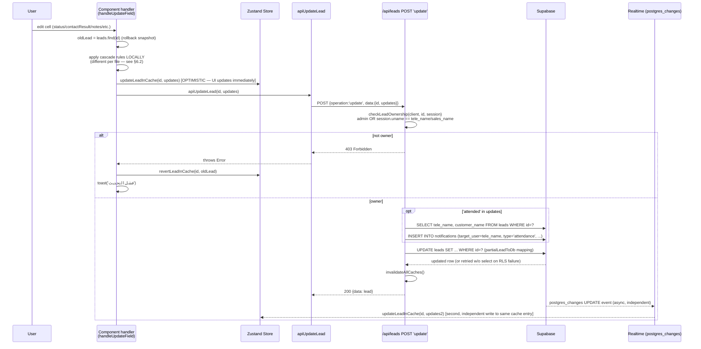

- **Cascade duplication (see §6.2 for full detail):** `tele-sheet.tsx:1326-1337` and `sales-sheet.tsx:841-863` each hard-code their own version of "what else changes when `status` changes." They are not the same logic (sales-sheet additionally manages `assignedAt` and `salesStatus`; tele-sheet does not).
- **Race:** the store is written to **twice** for the same edit — once optimistically by the component, once again by the realtime listener echoing the write back from the server (`page.tsx:466-534`). The realtime path has an explicit "null guard" (only overwrite with `null` if the existing cached value is already falsy) specifically to stop this second write from erasing the first, which confirms this was a known, previously-manifesting bug class.
- **Rollback:** present and correct for this path (`revertLeadInCache` restores the pre-edit object verbatim on any non-2xx/network failure or ownership rejection).
- **Transaction:** the attendance-notification insert and the `leads` update are **two separate statements, no transaction**. If the process crashes or the connection drops between them, the lead can be updated with no notification generated — silent, not surfaced anywhere as a resend mechanism.

### 4.4 Mark Attendance

**Duplicate implementations:** `my-meetings.tsx:561-581` and `employee-profile.tsx:496-510` independently reimplement the identical three-field write (`attended`, `attendanceMarkedAt`, `attendanceMarkedBy`) against the same generic `apiUpdateLead`/`update` endpoint. A third implementation, `PATCH /api/meetings` (`route.ts:140-212`), duplicates the ownership-check and field-set logic a second time on the **server**, but is never invoked by any client code (`apiMarkMeetingAttendance` in `lib/supabase.ts:723` has zero callers) — it is dead but live.

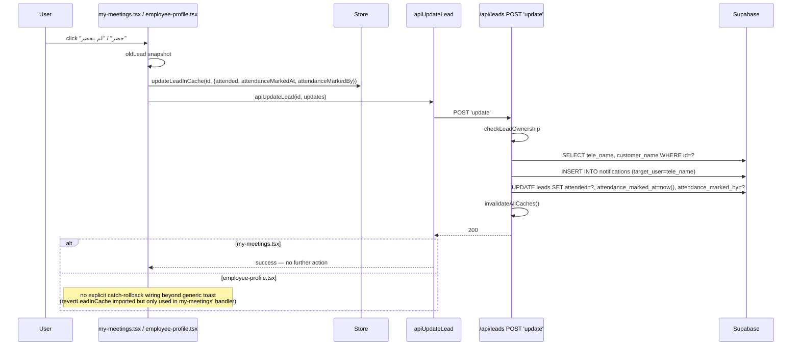

Note: `employee-profile.tsx:496-510`'s `catch` block only shows a toast (`'فشل في تسجيل الحضور'`) — it does **not** call `revertLeadInCache`, unlike the otherwise-identical handler in `my-meetings.tsx`. Two components performing the same business operation have different rollback guarantees.

### 4.5 Transfer Lead to Sales

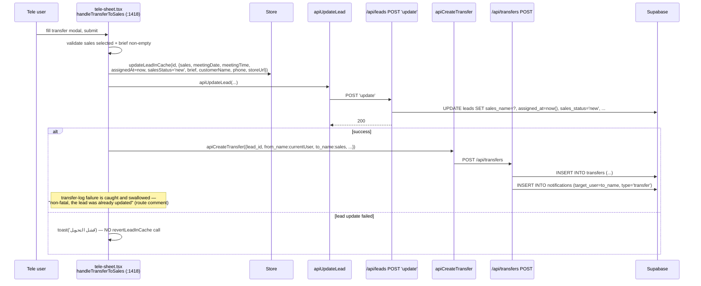

- **No rollback on the primary update failure** — unlike `handleUpdateField`, this handler does not capture an `oldLead` snapshot and never calls `revertLeadInCache` in its `catch`. If `apiUpdateLead` fails, the optimistic cache change (lead now shows `sales`, `assignedAt`, `salesStatus:'new'`) **remains visibly wrong in the UI** until a realtime event or manual refresh corrects it.
- **No transaction across the two POSTs.** If the tab closes or the network drops between the lead update succeeding and the transfer-record POST, the lead is transferred but no `transfers` row exists — the transfer history / audit trail is silently incomplete, and no reconciliation job exists to detect this.
- **Field ownership overlap:** this is one of two places `salesStatus` is written with the literal string `'new'` (an enum-like sentinel), while the same field is later overwritten with **free-text human notes** by `NotesCell` in `sales-sheet.tsx`/`follow-up-section.tsx` — see §6.1/§6.2.

### 4.6 Cancel Transfer

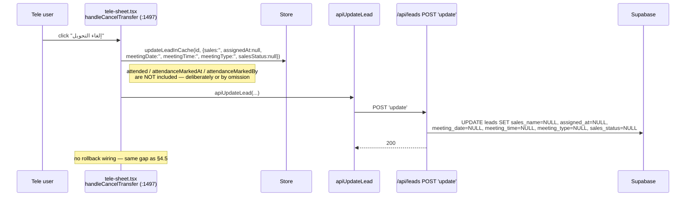

- **Stale-field carryover confirmed:** if a lead was previously marked `attended`/`no-show`, cancelling the transfer clears the transfer/meeting fields but **leaves `attended`, `attendance_marked_at`, `attendance_marked_by` untouched**. If the tele rep re-transfers this same lead to a different (or the same) sales rep, the new transfer's attendance card will immediately render the **stale prior outcome** instead of the "⏳ انتظار" (pending) state, because `AttendanceBadge` renders directly off `lead.attended` with no knowledge of "was this reset since the last transfer."

### 4.7 Delete Lead (single & bulk)

```mermaid
sequenceDiagram
    participant U as User
    participant C as tele-sheet.tsx / sales-sheet.tsx
    participant S as Store
    participant A as apiDeleteLead / apiDeleteLeadsBulk
    participant R as /api/leads DELETE or POST 'bulkDelete'
    participant DB as Supabase

    U->>C: click delete (single: opens confirm dialog; bulk: none in tele/sales-sheet)
    C->>S: removeLeadFromCache(id) / batchRemoveLeadsFromCache(ids)  [OPTIMISTIC, IMMEDIATE]
    C->>A: apiDeleteLead(id) / apiDeleteLeadsBulk(ids)
    A->>R: DELETE /api/leads?id= / POST 'bulkDelete'
    R->>R: checkLeadOwnership / checkBulkOwnership
    alt not owner
        R-->>A: 403
        C->>C: toast('فشل الحذف')  — lead stays REMOVED from UI despite not being deleted server-side
    else owner
        R->>DB: DELETE FROM leads WHERE id = ? (cascades lead_notes via FK)
        R->>R: invalidateAllCaches()
        R-->>A: 200
    end
```

- **No rollback on failure, by design** — the code comment at `tele-sheet.tsx:1373-1374` explicitly states: *"we already removed from cache — the realtime subscription or a manual refresh will correct the state if the DB delete failed."* This means a failed delete (e.g. an ownership rejection, or a network error) leaves the lead **invisible to the user who just tried to delete it**, silently relying on an external signal (realtime, or the user manually refreshing) to restore it. If realtime is disconnected at that moment (a documented, handled state — `realtimeStatus: 'disconnected'`), the lead **stays gone from the UI indefinitely** even though it still exists in the database.
- `admin-panel.tsx`'s bulk-delete (`AllLeadsTab.handleBulkDelete`, item #6 in the dashboard/admin agent report) has **no confirmation dialog at all** before this irreversible, no-rollback delete fires.
- **Cascade:** `lead_notes` rows are deleted via the FK's `ON DELETE CASCADE` (`supabase-schema.sql:109`) — this is the one place in the system where the database itself enforces referential cleanup; everywhere else (team member removal, etc.) referential cleanup is done manually in application code.

### 4.8 Archive / Unarchive Leads

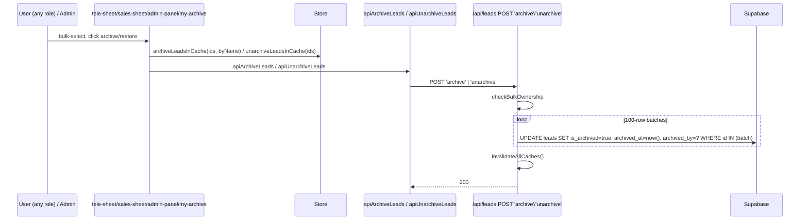

- `my-archive.tsx`'s unarchive handlers (`handleUnarchive`/`handleBulkUnarchive`) show a "فشل الاسترجاع" toast on failure but, per direct inspection, **do not call the inverse store action to put the lead back into `archivedLeads`** — the optimistic removal from the archive view persists client-side even when the server call fails, until the next full data reload.
- Batching (100 rows/request) means a failure partway through a very large bulk-archive leaves an **inconsistent partial state**: some IDs archived server-side, later batches not — and the client has already optimistically archived *all* selected IDs before any batch response returns (`archiveLeadsInCache(ids, ...)` is called once, up front, for the whole selection, not per-batch).

### 4.9 Team Member Management — the two divergent implementations

This is the most severe structural finding in this analysis. **Two live-in-repo API surfaces implement "remove a team member" with materially different, non-equivalent effects on the `leads` table**, and only one of them is reachable from the UI today.

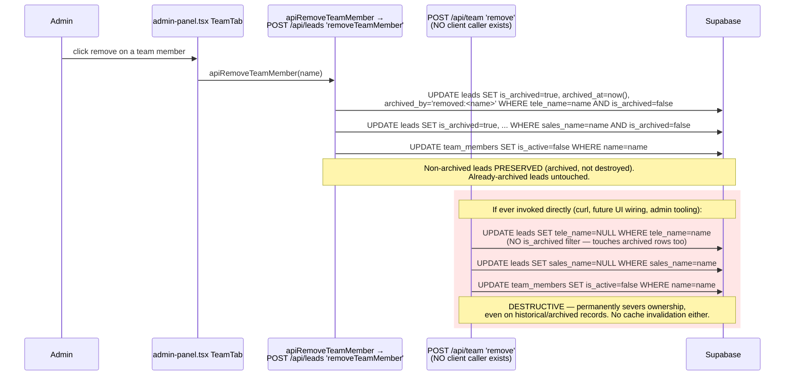

Both endpoints are `requireAdmin`-gated and both are fully functional if called — `/api/team`'s handler is not disabled, deprecated, or feature-flagged, it is simply **not wired to any current UI**. Anyone with an admin session token (or a leaked one) who calls `POST /api/team {operation:'remove', data:'<name>'}` directly gets the destructive, pre-fix behavior that the `/api/leads` version was specifically rewritten to avoid (per its own inline comment referencing the historical data-loss bug documented in Phase 1). The same divergence pattern exists for **rename** (`/api/team` 'rename' rewrites `leads.tele_name`/`sales_name` for **all** rows including archived, with no batching, vs. the also-live `/api/leads` 'renameTeamMember' doing the same without an archived filter either — these two happen to converge on rename, but not on remove).

`GET /api/team` and `apiGetTeam()` are similarly disconnected: the client reads team members via a **direct Supabase anon-client query** in `lib/supabase.ts:304-322` (`apiGetTeam`), never through the `/api/team` route at all. **The entire `/api/team/route.ts` file (both GET and POST) has zero callers anywhere in the client code** — it is dead code that happens to contain a more destructive variant of a live operation.

### 4.10 Access Permissions Save

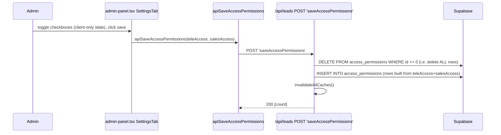

- **Not atomic / not transactional.** The delete-all-then-reinsert is two separate statements with no `BEGIN...COMMIT`. If the process fails or the connection drops between the `DELETE` and the `INSERT`, **the access-permissions table is left completely empty** — silently removing all viewer restrictions (fail-open on a permission table, since `canAccessTeleSheet`/`canAccessSalesSheet` treat "no entry" as "no extra access" for non-owners, so the practical effect of an empty table is everyone loses cross-visibility, not gains it — but it is still an unintended, unrecoverable full wipe with no backup/undo).
- Note from Phase 1 (§6.2 finding): the client-side consumers of this data (`canAccessTeleSheet`/`canAccessSalesSheet` in `store.ts`) are themselves dead code — no component calls them — so this entire feature (UI toggle → save → enforcement) has a live *write* path but an unverified/likely-absent *read/enforcement* path. This needs confirmation in the next audit phase (READ PATH ANALYSIS) but is flagged here because it directly affects how seriously the "fail-open" behavior above should be weighed.

### 4.11 User Account Management (`/api/auth`)

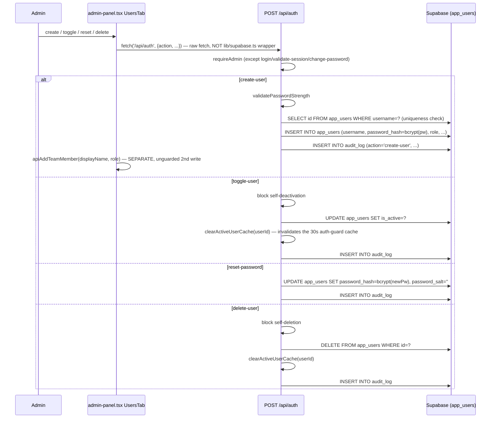

- **Two-write, non-transactional user creation:** `create-user` inserts into `app_users`, and then the **client** (not the server) separately calls `apiAddTeamMember` to insert into `team_members` (`admin-panel.tsx:791`). If the second call fails (caught and swallowed with only a `console.warn`, `admin-panel.tsx:797-799`), the result is a **login-capable user account with no corresponding `team_members` row** — such a user can authenticate but will not appear in any tele/sales roster, own no leads by name-matching, and will be invisible to `apiGetTeam()`. This is a genuine orphan-account risk with no reconciliation.
- **`app_users` deletion is a hard `DELETE`**, not a soft-delete/deactivate — historical `audit_log` rows referencing `actor_id`/`target_id` for a deleted user remain (no FK), but the user's own login history (`last_login_at`) is destroyed along with the row. `toggle-user` (deactivate) is the reversible alternative and is presented in the UI as a separate action from delete, so this is a deliberate design choice, not an oversight — noted for completeness.
- `clearActiveUserCache` closes the same 30-second revocation-lag gap for both `toggle-user` and `delete-user`, consistently.

### 4.12 Notifications: Mark Read

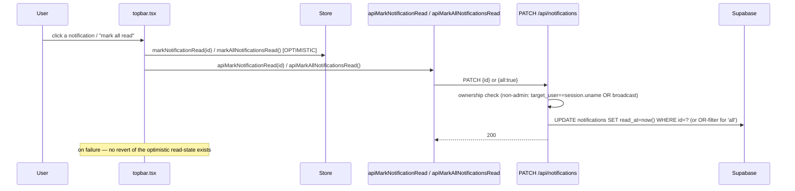

- The notification bell is **polled every 60 seconds** (`topbar.tsx`, confirmed by prior research pass), not realtime — so client and server unread-counts can be inconsistent for up to a minute in either direction, independent of the mark-read race itself.

### 4.13 Google Sheets Webhook Ingest (`/api/sheets-sync`)

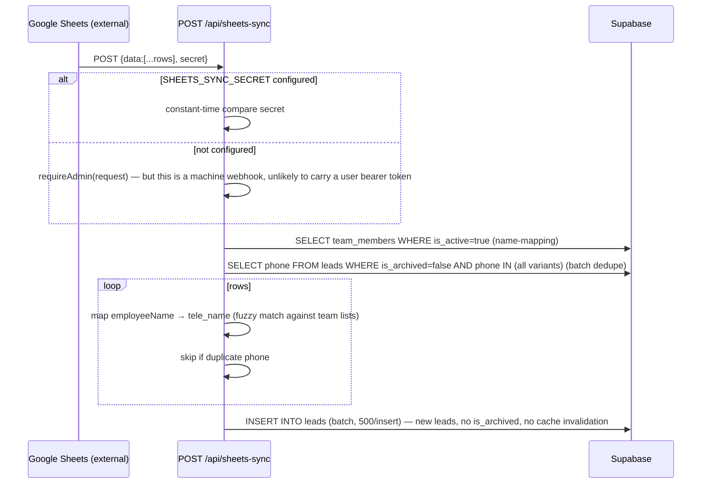

- **No cache invalidation.** This is a genuine, confirmed gap: `sheets-sync/route.ts` never imports `lib/api-cache.ts`. Leads created via this webhook will not appear in any `GET /api/leads` response served from the in-memory cache (up to 30s stale) or from a stale edge cache, even though they will appear correctly via the realtime channel to already-connected browser sessions. A fresh page load (new session) during that window undercounts.
- **Operational note:** if `SHEETS_SYNC_SECRET` is unset, the fallback is `requireAdmin`, which requires an `Authorization: Bearer <token>` header carrying a valid admin session — Google Sheets Apps Script webhooks do not naturally hold or refresh such a token, so in practice this endpoint is very likely to be **unusable without the shared secret configured**, or was tested only with the secret path. Confirming actual production configuration is out of scope for a code-only audit.

### 4.14 Admin Maintenance / Diagnostic Endpoints

`/api/cleanup-orphaned-leads`, `/api/fix-sales-leads-tele`, `/api/diagnose-leads-dates` (POST) all follow the same shape:

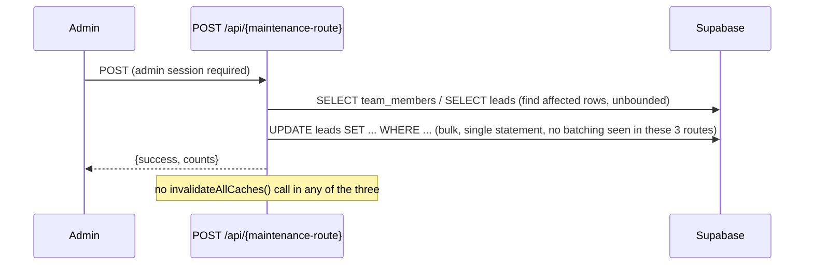

These are one-time repair tools (per their own doc comments) rather than steady-state product features, but they are permanently deployed, admin-authenticated, reachable endpoints that perform **unbatched, table-wide `UPDATE`s** (e.g. `fix-sales-leads-tele` loops per sales-name issuing one `UPDATE ... WHERE tele_name=X AND sales_name=X` per name — bounded by team size, so low risk in practice) without cache invalidation. Re-running them is designed to be idempotent (their own comments say so), which somewhat mitigates the missing-cache-invalidation gap since a stale cache would just be corrected on next natural TTL expiry.

---

## 5. Cross-Cutting Findings

### 5.1 Multiple Writers to the Same Field

| Field(s) | Writers | Consistency risk |
|---|---|---|
| `attended`, `attendance_marked_at`, `attendance_marked_by` | (1) `my-meetings.tsx` → `apiUpdateLead`; (2) `employee-profile.tsx` → `apiUpdateLead` (duplicate impl., no rollback); (3) dead `/api/meetings` PATCH (orphaned, would be a 3rd if ever reconnected) | Two live components independently implement identical business logic with **different error-handling guarantees**. A future fix to one (e.g. adding rollback) will not propagate to the other unless someone remembers both exist. |
| `sales_name`, `assigned_at`, `sales_status`, `meeting_date/time/type` | (1) `tele-sheet.tsx` `handleTransferToSales`; (2) `tele-sheet.tsx` `handleCancelTransfer`; (3) `sales-sheet.tsx` `handleUpdateField` status cascade; (4) `/api/team` & `/api/leads` team-rename/-remove operations (bulk, indirect) | Four independent code paths can change the same ownership/scheduling fields with **no shared invariant-checking function** — e.g. nothing prevents `assigned_at` being cleared by a rename cascade while `sales_status` is left at `'closed-won'`. |
| `sales_status` | (1) transfer creation sets `'new'`; (2) sales-sheet/follow-up-section `NotesCell` sets **arbitrary free text**; (3) status-cascade sets `'closed-won'` or `null`; (4) `isClosedWon()` reads it as an enum everywhere else | The most serious single-field overload in the system (already flagged in Phase 1, confirmed again here from the write side): a sales rep typing a note that happens to equal `"closed-won"` verbatim would flip every KPI that calls `isClosedWon()`. |
| `tele_name` / `sales_name` (ownership) | (1) `create`/`bulkCreate` (forced to session user); (2) transfer; (3) `/api/leads` `addTeamMember`/`removeTeamMember`/`renameTeamMember` (bulk); (4) dead `/api/team` equivalents (bulk, different semantics); (5) `/api/fix-sales-leads-tele` (bulk repair); (6) `/api/cleanup-orphaned-leads` (bulk, via archive) | Six distinct code paths mutate lead ownership. Three of them (`/api/team` twin, and to a lesser extent the maintenance scripts) are **not exercised by normal product usage**, meaning they are the least-tested code touching the most sensitive field in the schema. |
| `created_at` | (1) normal `INSERT` (`DEFAULT NOW()`); (2) `bulkCreate`'s synthetic backdated timestamps (`baseTime - index`); (3) `/api/diagnose-leads-dates` POST (`created_at = now()` for null rows) | Bulk-created leads do not carry a "true" creation instant — their `created_at` is a synthetically spaced value purely to guarantee stable sort order, which means any downstream logic trusting `created_at` as a real timestamp (e.g. "leads created today" KPIs) is working off fabricated-but-same-day values. Not a bug, but a leaky abstraction worth the next phase double-checking against the "ليدز جديدة اليوم" KPI. |
| `leads` cache (in-memory, `api-cache.ts`) | Invalidated by: `/api/leads` (all its write cases). **Not invalidated by:** `/api/meetings` PATCH, `/api/team` POST, `/api/transfers` POST, `/api/sheets-sync` POST, `/api/cleanup-orphaned-leads`, `/api/fix-sales-leads-tele`, `/api/diagnose-leads-dates` — all of which write directly to `leads` | See §5.7 below — this is systemic, not a one-off. |

### 5.2 Duplicate Business Logic

1. **Status-cascade logic** (`handleUpdateField`) is copy-pasted between `tele-sheet.tsx` and `sales-sheet.tsx` with silent drift (sales-sheet additionally handles `assignedAt`/`salesStatus` clearing that tele-sheet does not — see Phase 1 §4/§6.2 for the underlying rationale, reconfirmed here from the write-path side).
2. **Attendance-marking** logic is duplicated between `my-meetings.tsx` and `employee-profile.tsx`, plus a third, dead, server-side twin in `/api/meetings` PATCH.
3. **Team-member remove/rename** logic exists twice at the API layer (`/api/leads` vs `/api/team`), with the `/api/leads` version being a deliberate, documented rewrite of the exact bug the `/api/team` version still contains — the old version was never deleted.
4. **`EditableCell`/`NotesCell`/`BriefCell`** UI components are redefined near-verbatim in `sales-sheet.tsx`, `customers-status.tsx`, and `follow-up-section.tsx` rather than shared, meaning a fix to the write-debounce or error-handling behavior of one (e.g. adding rollback) requires three manual edits.
5. **Duplicate-phone detection** exists as three unconnected implementations: the dead `store.ts:buildDuplicatesCache`, and two independent local `useMemo` computations in `tele-sheet.tsx` and `sales-sheet.tsx` — none of these are "write" logic per se, but they gate what the `create` write path treats as a duplicate-warning trigger, and their disagreement risk was flagged in Phase 1.

### 5.3 Partial Update vs. Object Replacement

- **Partial** (`partialLeadToDb`, `/api/leads` `update`/PATCH): field-by-field `if ('field' in updates)` checks — the standard, safe pattern used by nearly every UI-driven edit. Correctly leaves untouched fields alone in SQL (`UPDATE ... SET onlyChangedCols`).
- **Full replacement** (`store.ts` `setLeads`): replaces the *entire client-side* `leads` array. Explicitly avoided for incremental loads (`page.tsx` uses `batchAddLeadsToCache` for phase-2 loading specifically **to avoid** this), but `setLeads` is still called on initial login load and on any full manual refresh — at those moments, any leads the current tab had locally added/deleted/archived optimistically but not yet confirmed by the server would be silently discarded and replaced by server truth. This is a narrow window (the two calls are not concurrent in normal operation) but is a real hazard if a refresh is triggered manually mid-optimistic-write.
- **Full replacement at the DB layer:** `saveAccessPermissions` (`DELETE FROM access_permissions WHERE id <> 0` then re-`INSERT`) is the one place a **write operation itself** is implemented as delete-and-replace rather than a diff/upsert — see §4.10 for the non-atomicity risk this creates.

### 5.4 Null vs. Undefined Propagation

- Client handlers frequently write `null as unknown as number` / `null as unknown as string` (e.g. `handleCancelTransfer`, `tele-sheet.tsx:1500,1504`) to force-clear a field. Because these are real `null` values (not `undefined`), they **survive `JSON.stringify`** and correctly reach `partialLeadToDb`'s `'field' in updates` check server-side, which is the intended behavior.
- By contrast, fields intentionally *omitted* from an `updates` object (`undefined`, never assigned) are **dropped by `JSON.stringify` before the request body is even built** — so the server-side `'field' in updates` check for those keys is `false`, and the corresponding DB column is correctly left untouched. This distinction (`null` = "clear it", absent key = "leave it") is applied **consistently** across `partialLeadToDb` and the client handlers reviewed — this is a place where the system behaves correctly, worth noting since it is easy to get wrong (and evidently was a source of past bugs, per the extensive "null guard" comments found in `page.tsx`'s realtime handler).
- The realtime path is the one place this contract is *not* trusted: `page.tsx:496-529` explicitly treats an incoming `null`/empty value for a currently-non-null cached field as **suspect** and skips applying it, specifically to defend against stale/out-of-order realtime events. This is a compensating control for a **different** risk (network reordering), not the null/undefined distinction itself, but it means the same nominal value (`null`) is trusted from the direct API-response path and distrusted from the realtime-echo path — an intentional but easy-to-forget asymmetry for future maintainers to know about.

### 5.5 Missing Transactions

None of the multi-statement write sequences in this codebase are wrapped in a database transaction (Supabase JS client calls here are all independent REST/PostgREST requests; no `BEGIN`/`COMMIT`, no Postgres function/RPC used for any multi-table write — the existing RPC functions, per `supabase-rpc-migration.sql`, are all read-only aggregation queries). Concretely non-atomic sequences identified in this analysis:

- `create` — duplicate-check `SELECT` then `INSERT` (§4.1).
- `update` with `attended` — notification `SELECT`+`INSERT` then leads `UPDATE` (§4.3).
- Transfer — leads `UPDATE` then `transfers` `INSERT` then `notifications` `INSERT` (§4.5), across **two separate HTTP requests** from the client (an even weaker boundary than a single route doing multiple statements).
- `bulkCreate` — N independent per-batch `INSERT`s with no all-or-nothing guarantee (§4.2).
- `saveAccessPermissions` — `DELETE` then `INSERT` (§4.10).
- User creation — `app_users` `INSERT` (server) then `team_members` `INSERT` (client, separate request) (§4.11).
- `removeTeamMember`/`renameTeamMember` — `team_members` `UPDATE` then one-or-two `leads` bulk `UPDATE`s (§4.9).

### 5.6 Concurrent Writes, Race Conditions, Last-Write-Wins

1. **Optimistic-write vs. realtime-echo race (systemic):** every `apiUpdateLead` call updates the local store immediately, then the same change round-trips back via `postgres_changes` and is applied to the store a second time (§4.3 diagram). The realtime null-guard mitigates the worst case (a stale event blanking a field) but does **not** prevent the general last-write-wins outcome when two different users edit the same lead's same field within the same short window — whichever `UPDATE` reaches Postgres last wins at the DB level, and both users' browsers will eventually converge on that value with no conflict notification to the user who "lost."
2. **No optimistic locking / version column anywhere in the schema.** `leads` has no `updated_at`/version field used for compare-and-swap; every `UPDATE ... WHERE id = ?` unconditionally overwrites whatever is currently in the row.
3. **Bulk-create fallback re-fetch ambiguity (§4.1, §4.2):** the "RLS read-back returned null, so re-fetch by timestamp window" fallback can, under concurrent creates from two users, attribute another user's freshly-inserted rows to the wrong requester's optimistic-cache insert. Low probability, non-zero impact (a lead could silently appear to have been created by/visible to the wrong flow momentarily until the next full sync).
4. **Cache-invalidation race:** because `/api/meetings`, `/api/team`, `/api/transfers`, `/api/sheets-sync`, and the three maintenance routes never call `invalidateAllCaches()`, a write through any of them can be **masked for up to 30–60 seconds** by a `GET /api/leads` or `GET /api/stats` response still being served from the in-memory cache on the same server instance — a genuine, reproducible stale-read window, distinct from the (already-mitigated) client-store race above.
5. **Team-member reactivation vs. concurrent lead assignment:** `addTeamMember` (reactivation branch) nulls `tele_name`/`sales_name` on all of that name's non-archived leads (`route.ts:889-890`) with no locking; if a write assigning a lead to that same name is in flight at the same moment (e.g. a bulk-create with `tele:` set to the about-to-be-reactivated name), the outcome depends purely on statement ordering at the database, with no application-level coordination.

### 5.7 Cache Invalidation Coverage — Full Table

| Route | Writes `leads`? | Calls `invalidateAllCaches()`? |
|---|---|---|
| `/api/leads` (all write cases) | ✅ | ✅ (except `bulkUpdate`, `updateNote`, and `saveSetting` due to the `WRITE_OPERATIONS` set mismatch noted in §3, row 12/17 and below) |
| `/api/meetings` PATCH | ✅ | ❌ |
| `/api/team` POST | ✅ (indirectly, via `tele_name`/`sales_name`) | ❌ |
| `/api/transfers` POST | ❌ (writes `transfers`/`notifications` only) | N/A |
| `/api/sheets-sync` POST | ✅ | ❌ |
| `/api/cleanup-orphaned-leads` POST | ✅ | ❌ |
| `/api/fix-sales-leads-tele` POST | ✅ | ❌ |
| `/api/diagnose-leads-dates` POST | ✅ | ❌ |
| `/api/auth` (all actions) | ❌ (`app_users` only) | N/A |
| `/api/daily-reports`, `/api/audit-log`, `/api/notifications` | ❌ (own tables only) | N/A |

**Additionally, within `/api/leads` itself:** `WRITE_OPERATIONS` (`route.ts:9-14`) is a hand-maintained `Set` checked against the operation name to decide whether to call `invalidateAllCaches()`. Cross-referencing it against the actual `switch` cases:
- `'setSetting'` is in the set, but the real case is named `'saveSetting'` — **this write never invalidates the cache** (typo/drift, not intentional).
- `'bulkUpdate'` has a case but is **not** in the set — **never invalidates the cache**.
- `'updateNote'` has a case but doesn't even call the `success()` wrapper that checks the set — **never invalidates the cache**, unconditionally.

This is a clear example of a manually-synchronized allowlist drifting out of sync with the switch statement it's meant to cover.

### 5.8 Rollback / Optimistic-Update Consistency

| Handler | Optimistic write? | Rollback on failure? |
|---|---|---|
| `handleUpdateField` (tele-sheet, sales-sheet) | ✅ | ✅ `revertLeadInCache` |
| `handleMarkAttendance` (my-meetings) | ✅ | ✅ |
| `handleMarkAttendance` (employee-profile) | ✅ | ❌ toast only |
| `handleUpdateField` (my-meetings, notes) | ✅ | ✅ |
| `handleTransferToSales` | ✅ | ❌ |
| `handleCancelTransfer` | ✅ | ❌ |
| `handleConfirmDelete` / `handleDeleteLead` | ✅ (removal) | ❌ (by design, per code comment) |
| `handleBulkDelete` | ✅ | ❌ |
| `handleBulkArchive` | ✅ | ❌ |
| `handleUnarchive` / `handleBulkUnarchive` (my-archive) | ✅ | ❌ |
| `TeamTab` add/remove/rename (admin-panel) | ✅ (local `team` object patch) | ❌ |
| Notifications mark-read (topbar) | ✅ | ❌ |

Out of the write flows that perform an optimistic UI update, **fewer than a third implement a true rollback**. The two that do (`handleUpdateField`, `my-meetings`'s attendance handler) share the exact same idiom (`oldLead` snapshot → optimistic set → `try/catch` → `revertLeadInCache`), which is good evidence this idiom is the intended house style — the remaining handlers simply never had it applied.

### 5.9 Dead/Orphaned Write Endpoints (Attack-Surface & Maintenance Risk)

Confirmed via exhaustive call-site search (zero occurrences of the client wrapper anywhere in `src/components` or `src/app`, excluding the wrapper's own definition):

| Dead endpoint / function | Still live & authenticated? | Risk if invoked directly |
|---|---|---|
| `PATCH /api/meetings` (`apiMarkMeetingAttendance`) | ✅ requires auth + ownership | Low — logic mirrors the live path, just unreachable from UI |
| `POST /api/team` (`add`/`remove`/`rename`) | ✅ requires admin | **High for `remove`** — see §4.9, permanently nulls ownership on archived rows, no cache invalidation |
| `POST /api/leads` `bulkUpdate` | ✅ requires auth + bulk-ownership | Medium — functions correctly but silently skips cache invalidation |
| `POST /api/leads` `updateNote` / `addNote` / `deleteNote` (and `GET/POST /api/chat`) | ✅ requires auth | Low functional risk, but represents an entire unused feature (per-lead notes / WhatsApp-style chat) with live write access to `lead_notes` that no UI surfaces for review — a channel for undetected data insertion if a token is compromised |
| `POST /api/leads` `saveSetting` | ✅ requires admin | Low — functions, cache-invalidation typo only |
| `GET/POST /api/daily-reports` | ✅ requires auth | Low — isolated table, but confirms a shipped feature has no UI |

None of these are exploitable beyond what a legitimate authenticated/admin session could already do through the intended UI — they are not privilege-escalation paths. They are, however, **untested-by-usage code that silently diverges from its "successor," and a maintenance/audit liability**: a future engineer grep-ing for "how does remove-team-member work" and landing on `/api/team` first would learn the wrong (and more dangerous) answer.

---

## 6. Summary Table — Highest-Priority Write-Path Risks

| Priority | Finding | Where |
|---|---|---|
| 1 | `/api/team` `remove`/`rename` are live, more-destructive, uncached duplicates of the `/api/leads` equivalents that the UI actually calls | §4.9 |
| 2 | Cache invalidation is inconsistent: 7 of ~14 write routes that touch `leads` never call `invalidateAllCaches()`; 3 operations inside `/api/leads` itself are excluded by a drifted allowlist | §5.7 |
| 3 | Optimistic UI updates have no rollback for delete/bulk-delete/archive/unarchive/transfer/cancel-transfer — failures leave the UI silently wrong until realtime or a manual refresh corrects it | §5.8, §4.5–§4.8 |
| 4 | `salesStatus` is written as both an enum sentinel (`'new'`, `'closed-won'`) and arbitrary free text by different components with no separation | §5.1, §5.2 |
| 5 | No transactions anywhere; several logically-atomic operations (transfer, user creation, access-permissions save, attendance notification) are two-plus independent statements/requests that can partially fail | §5.5 |
| 6 | No optimistic locking/version column; last-write-wins is the only conflict-resolution strategy for concurrent edits to the same lead | §5.6 |
| 7 | Cascade/business logic for status changes is duplicated and already drifted between `tele-sheet.tsx` and `sales-sheet.tsx` | §5.2 |
| 8 | An entire notes/chat feature (`lead_notes` write API + `/api/chat`) and the daily-reports submission API are shipped, authenticated, and completely unused by any current UI | §5.9 |

---

*End of Write Path Analysis. No fixes were proposed or applied. Per the audit workflow, this phase stops here for review before proceeding.*
